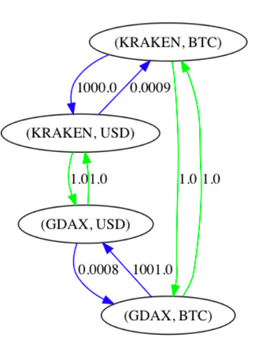

# Technical Exercise

## The Exchange Rate Path Problem

In order to provide our customers a product that lets them spend cryptocurrencies to buy goods from merchants who only accept fiat currency, we need to solve two

### problems:

1. Determine a sequence of trades and transfers across exchanges to convert 
the cryptocurrency to fiat currency with a suitable exchange rate

2. Provide the best possible exchange rate to our customers
You are tasked with implementing a solution to this problem (details provided below).

## Input Data

You will receive a stream of price updates and exchange rate requests on stdin.

Each price update or exchange rate request will be separated by a newline.

### Price Updates

The price updates will be of the form:

```
<timestamp> <exchange> <source_currency> <destination_currency> <forward_factor> <backward_factor>
```

Each field is separated by whitespace. For example,

```
2017-11-01T09:42:23+00:00 KRAKEN BTC USD 1000.0 0.
```

signifies that a price update was received from Kraken on November 1, 2017 at 9:42am. The update says that 1 BTC is worth $1000 USD and that $1 USD is worth 0.0009 BTC.

The forward_factor and backward_factor will always multiply to a number that is less than or equal to 1.

Price updates are not guaranteed to arrive in chronological order. You should only consider the most recent price update for each (source_currency,destination_currency) pair when responding to an exchange rate request.

### Exchange Rate Requests

Exchange rate requests will be:

```
EXCHANGE_RATE_REQUEST <source_exchange> <source_currency> <destination_exchange> <destination_currency>
```

arriving as a line on stdin. This represents the question: What is the best exchange rate for converting source_currencyon source_exchange into destination_currency on destination_exchange, and what trades and transfers need to be made to achieve that rate?

## The Exchange Rate Graph

Each (exchange, currency) pair can be considered as a vertex in a graph. Vertices are created the first time a price update appears that references them. For the sake of this exercise, you can assume that vertices are never removed.

The vertices are connected with edges according to the following rules:

1. After receiving a price update, the edge from (exchange,source_currency) to (exchange, destination_currency) is assigned
weight forward_factor, and the edge from (exchange,destination_currency) to (exchange, source_currency) is assigned weight backward_factor.

For example, after receiving price update:
2017-11-01T09:42:23+00:00 KRAKEN BTC USD 1000.0 0.0009 an edge from (KRAKEN, BTC) and (KRAKEN, USD) should be created if it does not already exist, and its edge weight should be assigned 1000.0, and an edge from (KRAKEN, USD) to (KRAKEN, BTC) should be created if it does not already exist,
and its edge weight should be assigned 0.0009.

2. For each currency, each (exchange, currency) is connected to every other (other_exchange, currency) with an edge weight of 1.0. For example, after receiving the price updates:

```
2017-11-01T09:42:23+00:00 KRAKEN BTC USD 1000.0 0.0009
2017-11-01T09:43:23+00:00 GDAX BTC USD 1001.0 0.0008
```

the graph would have the following edges:

```
(KRAKEN, BTC) -- 1000.0 --> (KRAKEN, USD)

(KRAKEN, USD) -- 0.0009 --> (KRAKEN, BTC)

(GDAX, BTC) -- 1001.0 --> (GDAX, USD)

(GDAX, USD) -- 0.0008 --> (GDAX, BTC)

(KRAKEN, BTC) -- 1.0 --> (GDAX, BTC)

(GDAX, BTC) -- 1.0 --> (KRAKEN, BTC)

(KRAKEN, USD) -- 1.0 --> (GDAX, USD)

(GDAX, USD) -- 1.0 --> (KRAKEN, USD)
```


Edges are never removed.

## Finding the Best Exchange Rate

When you receive an exchange rate request, your job is to return the best possible exchange rate as well as the trades and transfers needed to achieve that rate. One way of achieving this is to use a modification of the Floyd-Warshall algorithm for finding the shortest paths between all pairs of vertices in a graph. If you're not familiar with the Floyd-Warshall algorithm and you're interested ( NOT required for solving this exercise!), you can find more information about it [here](https://en.wikipedia.org/wiki/Floyd%E2%80%93Warshall_algorithm).

The variant we will use substitutes the min operator with max, and instead of using addition to concatenate paths, we will use multiplication. Don't worry if you're not
familiar with graph algorithms, pseudocode for the algorithm is below!

```
let rate[][] = a lookup table of edge weights initialized to 0 for each
(source_vertex, destination_vertex) pair
let next[][] = a lookup table of vertices initialized to None for each
(source_vertex, destination_vertex) pair
let V[] = an array containing each vertex

procedure BestRates()
    for each edge (u,v)
        rate[u][v] ← w(u,v) // the weight of the edge (u,v)
        next[u][v] ← v
    for k from 1 to length(V) // modified Floyd-Warshall implementation
        for i from 1 to length(V)
            for j from 1 to length(V)
                if rate[i][j] < rate[i][k] * rate[k][j] then
                    rate[i][j] ← rate[i][k] * rate[k][j]
                    next[i][j] ← next[i][k]

procedure Path(u, v)
    if next[u][v] = null then
        return []
    path = [u]
    while u ≠ v
        u ← next[u][v]
        path.append(u)
    return path
```

## Output Format

For each exchange rate request line you receive on stdin, you should output to stdout:

```
BEST_RATES_BEGIN <source_exchange> <source_currency> <destination_exchange>
<destination_currency> <rate>
<source_exchange, source_currency>
<exchange, currency>
<exchange, currency>
...
<destination_exchange, destination_currency>
BEST_RATES_END
```
where source_exchange, source_currency, destination_exchange, and destination_currency are the respective exchanges and currencies from the exchange rate request received on stdin, and rate is the best rate found for converting from the (source_exchange, source_currency) to the (destination_exchange,destination_currency)using the algorithm.

After that, each line represents a vertex on the path in the graph. The vertices should be output one per line and in the same order as the path in the graph should be traversed according to the algorithm. This list of vertices should start with
the source_exchange, source_currency pair and end with the destination_exchange, destination_currency pair.

After outputing the path, you should output the line BEST_RATES_END.
